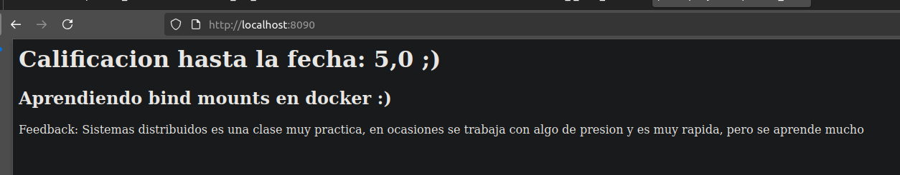

# Parcial_Distribuidos

# Autor
**Diego Alejandro Gil Otálora**  
Código: 202222152  
Universidad Pedagógica y Tecnológica de Colombia  
Ingeniería de Sistemas y Computación - Sistemas Distribuidos  
Tunja, 2025  

---

## Ejercicio 1 — Imagen Personalizada

- Corriendo el contenedor

## Ejercicio 2 — Persistencia con volumenes

- Crear el volumen 

- Crear el contenedor de postgres

- Creacion de tabla y registros

- Eliminando contenedor y levantando otro con el mismo volumen. (Verificando que los datos siguen ahi)

## Ejercicio 3 — Bind mount y edicion en vivo

- Creacion de un directorio con un archivo (index.html)

- Ejecutando contenedor nginx para servir archivo mediante bind mount de solo lectura

- Acceder al navegador mediante http://localhost:8080
(Para este ejercicio cambie 8080 por 8090 ya que no queria generar algun conflicto con un contenedor ya existente corriendo en ese puerto)

- Modificando el index.htm y mostrando el cambio 

## Ejercicio 4 — Exploracion de contenedores

- Ejecutando en modo interactivo, creando archivos, mostrando ruta de trabajo y listando archivos

se demuestra que existe tanto notas.txt como mensaje.txt

- Saliendo del contenedor, eliminandolo y levantando otro con la misma imagen

Se evidencia que notas.txt ya no existe. Supongo que por falta de persistencia (volumenes o bind mounts)

## Ejercicio 5 — Redis con Dockerfile

- Construyendo la imagen con nombre personalizado (diegoalejandrogil22)

- Levantando el contenedor en segundo plano a travez de la imagen

- Revisando los logs del contenedor

